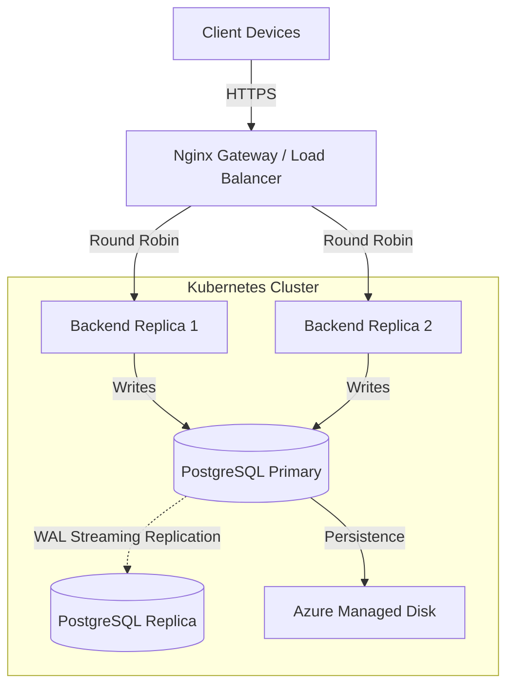

# 📝 Distributed Shared Note-Taking System

A **fault-tolerant, high-availability collaborative note-taking platform** designed to demonstrate real-world **Distributed Systems Architecture** concepts. The system is containerized with Docker, orchestrated using Kubernetes, and deployed on **Azure Kubernetes Service (AKS)**.

> This project goes beyond a typical CRUD application by explicitly addressing **race conditions, data consistency, fault tolerance, and scalability** in a distributed environment.

---

## 📖 Project Overview

In real-time collaboration systems, concurrent writes introduce serious consistency challenges. This project solves that problem using a **custom Distributed Pessimistic Locking mechanism**, ensuring that only one user can edit a note at a time while maintaining system availability.

Key distributed systems principles demonstrated:

* Single-writer integrity
* Active–Active service replication
* Active–Passive database replication
* Horizontal scalability
* Self-healing infrastructure

---

## 🚀 Key Features

### 🔒 Distributed Concurrency Control

* Custom **Pessimistic Locking** mechanism
* Heartbeat-based lock validation
* Only one client can hold the **write token** for a note at any given time
* Prevents overwrite conflicts during simultaneous edits

### ⚖️ High Availability (HA)

* Deployed on **Azure Kubernetes Service (AKS)**
* **Nginx Ingress Controller** distributes traffic across multiple backend replicas
* Stateless backend services enable seamless failover

### 💾 Data Persistence & Redundancy

* **PostgreSQL Active–Passive Replication**
* WAL (Write-Ahead Logging) streaming for consistency
* Persistent storage backed by **Azure Managed Disks**

### 📈 Horizontal Scalability

* **Horizontal Pod Autoscaler (HPA)** configured
* Automatically scales backend pods based on CPU utilization
* Handles traffic spikes without downtime

### 🛡️ Role-Based Access Control (RBAC)

* Fine-grained permissions
* Roles:

  * **Admin** – Full access
  * **User** – Create & edit own notes
  * **Guest** – Read-only access

### ⚡ Self-Healing Infrastructure

* Kubernetes **Liveness Probes** continuously monitor services
* Crashed pods are automatically restarted
* No manual intervention required

---

## 🏗️ System Architecture

The system follows a **microservices-based architecture** deployed on cloud infrastructure.



---

## 🧱 Infrastructure Components

| Layer                | Technology                                 |
| -------------------- | ------------------------------------------ |
| **Frontend**         | React.js                                   |
| **Gateway**          | Nginx Reverse Proxy & Ingress Controller   |
| **Backend**          | Node.js / Express (Stateless & Replicated) |
| **Database**         | PostgreSQL (Primary + Replica)             |
| **Orchestration**    | Kubernetes (AKS)                           |
| **Containerization** | Docker                                     |

---

## 🛠️ Technology Stack

| Category           | Technologies                                                       |
| ------------------ | ------------------------------------------------------------------ |
| **Cloud & DevOps** | Microsoft Azure, AKS, Azure Container Registry, Docker, Kubernetes |
| **Frontend**       | React.js, Tailwind CSS, Axios                                      |
| **Backend**        | Node.js, Express.js                                                |
| **Database**       | PostgreSQL (ACID Compliant)                                        |
| **Tools**          | Git, VS Code, Postman, Azure CLI                                   |

---


## ⚡ Getting Started (Local – Docker Compose)

Run the full distributed stack locally using Docker.

### ✅ Prerequisites

* Docker Desktop
* Node.js 18+

### 📦 Installation

Clone the repository:

```bash
git clone https://github.com/thesarakasun/Distributed-_System.git
```

Start the system:

```bash
docker-compose up --build
```

### 🌐 Access the Application

* **Frontend:** [http://localhost](http://localhost)
* **Backend API:** [http://localhost:3001](http://localhost:3001)

---

## ☁️ Cloud Deployment (Azure AKS)

To deploy updates to the live Azure cluster:

```bash
# 1. Login to Azure Container Registry
az acr login --name team04registry

# 2. Build & Push Images
docker build -t team04registry.azurecr.io/frontend:v9 -f ./client/Dockerfile ./client
docker push team04registry.azurecr.io/frontend:v9

# 3. Update Kubernetes Deployment
kubectl set image deployment/frontend frontend=team04registry.azurecr.io/frontend:v9
```